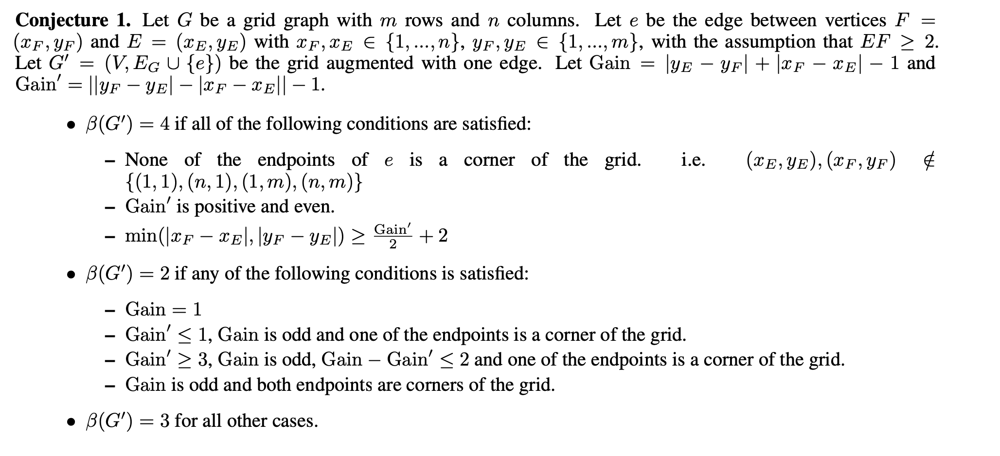

# Testing a conjecture for Metric Dimension of Grid + Edge



For a mxn grid augmented with one edge, to check that there is no resolving set of size 3 if and only if the MD=4 condition in our conjecture hold, run
```
bash compile.sh
./four_checker m n
```
To check that there is a resolving set of size 2 if and only if the MD=2 condition in our conjecture hold, run
```
./two_checker m n
```
Success message at the end of the output of the script indicates that the conjecture is verified for that case.
Note that since we proved that the MD of the grid+edge is between 2 and 4, running both of these programs checks the entire statement of the conjecture. We have verified it for grids of size upto 20 x 20. 

Since we are doing an exhaustive brute-force search, running these files may take long time. For example, checking for 
10 x 10 grid when MD is 4 takes around 165 secs. To reduce this time, we have made an assumption that for every grid + edge, there 
will exist a resolving set with minimal size for which all the resolving points will lie on the boundary of the grid. This 
will reduce our search space for resolving set. We don't yet have a proof for this but it seems quite intuitive.
To verify with this assumption, run files ``opt_four_checker`` and ``opt_two_checker`` similarly.
This takes around 12 secs to verify 10 x 10 grid when MD is 4. 
